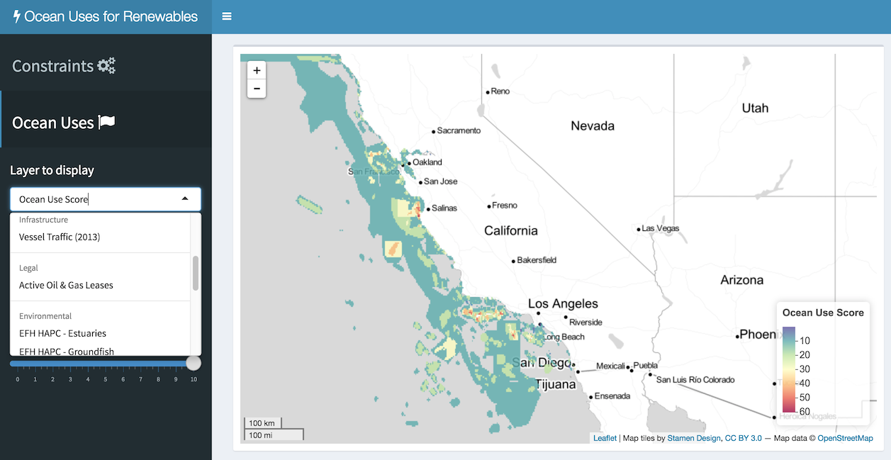

# nrel-uses
Competing ocean uses work with National Renewable Energy Lab (NREL)

# Interactive Application

The [Shiny](http://shiny.rstudio.com/) app provides an interactive web interface to data layers, particularly for implementing alternative weights and sliders to ocean use layers for identifying areas of conflict.

[](https://ecoquants.shinyapps.io/nrel-uses/)

## Web Browser

You can find this app online here:

[ecoquants.shiny.io/nrel-uses](https://ecoquants.shinyapps.io/nrel-uses/)

## Locally with R

You can also directly run the app from a local desktop instance of the [R]() statistical programming language as long as you already have the libraries installed that are listed at the top of the [global.R](https://github.com/ecoquants/nrel-uses/blob/master/app/global.R#L1-L9) file (e.g. `install.packages("shiny")`).

```r
shiny::runGitHub('ecoquants/nrel-uses', subdir='app')
```
